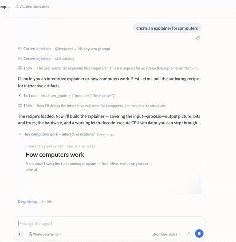
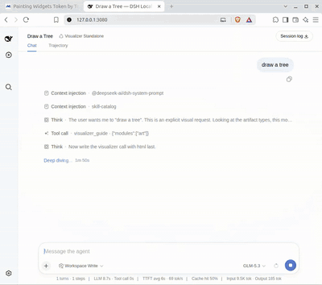

# dsh-visualizer

A [DeepSeek Harness](https://github.com/deepseek-ai/deepseek-harness) plugin. The **`visualizer`** tool streams a self-contained HTML document into the chat as the model writes it, with a live preview in a sandboxed inline frame — Chart.js, external CDN libraries, all of it. Nothing touches the workspace.

One package ships both halves: the model-facing tool (`lib/index.js`) and the Web GUI card (`lib/client.js`, declared through the package's `dsh.client` manifest). Install it and a bundle layer mounts both. No manual profile patch editing.





Every generation is downloadable from the card as a self-contained `.html` (or `.svg`) file. No server round-trip.

Settled cards also carry a **comment mode**: toggle the pen control in the row chrome, click any element (or drag a rectangle) inside the frame, and each pick becomes a comment row below the renderer showing the element's selector, markup, and text. Write a note per pick and Send — the picks compose one `[widget]` turn for the model, locator bundle included, so it can edit the exact elements you pointed at. Esc or the toggle exits; the document runs pristine while mode is off.

Full-length demos, one per artifact type:

1. [Pull request flow overview](assets/demos/bitbucket_datacenter_full.webm) — diagram
2. [Photosynthesis explainer](assets/demos/photosynthesis_explainer_trimmed.webm) — interactive
3. [How computers work](assets/demos/how-computers-work.gif) — mockup (shown above)
4. [The plugin itself, explained and rendered by the plugin](assets/demos/plugin_explainer_full.webm) — self-hosted
5. [Streaming generative UI highlights](assets/demos/streaming-generative-ui-highlights.webm) — highlights
6. [Combined demo](assets/demos/combined-demo.webm) — multiple use cases in one run

## Install

Requires Node ^22.19 or >=24 and a DeepSeek Harness installation on `0.1.2-rc.1` or newer (older builds: see [Harness version](#harness-version) below):

```sh
# install into the default web profile
dsh plugin --profile web add 'git+https://github.com/abidhmuhsin/dsh-visualizer.git'

# or install into any custom profile
dsh plugin --profile <your-profile> add 'git+https://github.com/abidhmuhsin/dsh-visualizer.git'
```

The first run fails with an "Add the package to allowBuilds" hint. That's pnpm's supply-chain gate blocking the `prepare` build until it's allowlisted; the hint carries the exact key, keyed on the codeload URL and the resolved commit. Paste that block under `allowBuilds:` in `~/.dsh/profiles/<your-profile>/pnpm-workspace.yaml` and re-run. Keys pin the commit, so after a new upstream push, reinstalling prints a fresh hint to paste.

### Harness version

The default branch tracks the **latest DeepSeek Harness pre-release** (`0.1.2-rc.1` or newer). `0.1.2-alpha.3` renamed the client `conversationEvents` service to `uiConversation` and moved the Chat Node out of `dsh-client-ui-conversation` into the new `dsh-client-ui-chat` package, so the card cannot mount on builds older than that — the tool parks at `pending (waiting for service: conversationEvents)`. `0.1.2-rc.1`'s Compact transcript view can fold a settled card away once its turn closes; see [Settled cards and Compact transcript view](#settled-cards-and-compact-transcript-view) below for how this plugin handles that.

On an older harness (`0.1.1-rc.2` and earlier pre-alpha builds), install the pre-alpha compatibility branch instead, with a ref fragment:

```sh
dsh plugin --profile <your-profile> add 'git+https://github.com/abidhmuhsin/dsh-visualizer.git#pre-harness-0.1.2-alpha3-compat'
```

That branch is the last state of the plugin built against the pre-`0.1.2-alpha.3` client API. It is frozen — new features land on the default branch only — so upgrading the harness is the way forward.

### Settled cards and Compact transcript view

Compact transcript view folds a settled card's tool-call row away once its turn closes. This plugin keeps the card live in place until then, and republishes it through the harness's `turn-tail` extension point once the turn closes — the only way to survive the fold, since that hole doesn't exist any earlier. Normal view never folds, so the card just stays where it always was, with no second copy. See `CHANGELOG.md` for the mechanics.

### Or Install from a local checkout

To hack on the plugin (or install a version not yet pushed), check it out, build, and add it by local path:

```sh
git clone https://github.com/abidhmuhsin/dsh-visualizer.git ~/tools/dsh-visualizer
cd ~/tools/dsh-visualizer
pnpm install
pnpm build

cd ~/tools/deepseek-harness
pnpm dsh plugin --profile visualizer add '/home/user/tools/dsh-visualizer'
```

A local path skips the git fetch and the `allowBuilds` dance, since `pnpm build` already produced `lib/`. The loader still imports from the installed copy under the profile, though. To pick up changes: re-run `pnpm build` in the checkout, then `remove` and `add` again.

Boot the profile and ask the model to **"visualize …"**; the streamed document appears inline while it's written. Pin a release with a ref fragment (`'git+https://github.com/abidhmuhsin/dsh-visualizer.git#v0.2.0'`). To remove:

```sh
dsh plugin --profile <your-profile> remove dsh-visualizer
```

## How it mounts

The package declares a `dsh.bundle` manifest (`dsh.bundle.patch` → `./cordis.patch.yml`), so `dsh plugin add` installs it as a profile patch layer on its own. That layer inserts one loader row for the package:

- The host Loader imports `lib/index.js`; its `apply()` registers the model-facing `visualizer` tool.
- The Web GUI's client module system scans Loader entries for packages declaring a `dsh.client` manifest and serves `lib/client.js`, which renders the streaming card and the settled row.

## Configuration

The bundle layer already inserts the loader row, so overriding config takes a flat id-targeted patch entry in the profile's own patch layer (`~/.dsh/profiles/<your-profile>/cordis.patch.yml`). Don't wrap it in `insert:` — that appends a second row instead of overriding the installed one. The complete option list, at current defaults:

```yaml
- id: dsh-visualizer
  config:
    maxArtifactBytes: 262144      # per-call render size limit, in bytes
    guideTool: true               # false = drop the visualizer_guide recipe tool (render tool stays)
    guideTypes: [chart, diagram, mockup, interactive, art]   # which types to teach and allow
    shareArtifacts: true          # false = no disk mirror, serve route, or Share control
    artifactDir: ~/.dsh/visualizer/artifacts        # $DSH_HOME honored
    artifactRetentionDays: 30     # sweep artifacts older than this at activation; 0 disables
    shareKey: ''                  # pin the link key so links survive restarts
```

`guideTypes` narrows both guide surfaces at once: a disabled type is rejected at the tool's argument boundary, and unknown ids or an empty list fail the plugin load.

## How it works

The tool declares `html` as its last schema parameter, so logged call arguments carry a growing document prefix while the model streams. The card paints that prefix live inside a null-origin sandboxed iframe; at dispatch the final DOM reconciles and scripts run once. An authoring guide teaches the model when to reach for each artifact type (`chart`, `diagram`, `mockup`, `interactive`, `art`) and how to author it — a one-line roster in the system prompt, with deeper per-type recipes on demand through a `visualizer_guide` tool so the standing prompt stays small. A settle-time static check inspects the finished document (compiled, never executed) and reports defects back to the model for an in-turn fix.

Rendered documents can talk back through a small bridge: scripts may submit a follow-up chat prompt (`sendPrompt`, validated and rate-limited), open http(s) links (`openLink`, scheme-checked), and persist state across renders (`window.storage`, namespaced by title — a regenerated dashboard finds its previous values). Documents inherit the app's theme tokens, and anchor clicks inside the card never navigate the app: fragments scroll in place, external links pass the same validation gate. A card shows load/runtime script failures inline instead of silently rendering nothing. `window.share` (`{exported, url}`, plus a `dsh-share-status` window event) tells a document its own current share state — read-only; a document can observe whether it has been shared but never trigger a share itself, since that stays a deliberate, one-click chrome action.

A settled card offers four actions before it's shared — **Fullscreen** (expands the card to the viewport; Escape or a second click leaves), **Download** (self-contained `.html`/`.svg` via Blob, no server round-trip), **Copy HTML**, and **Export** (next section) — and three more once it is: **Share**, **Copy share link**, and **Unshare**. When a document fails — a library that never loaded, or a script that threw — the card's error notice grows one more: one click that asks the model to repair the render, since the settle-time check compiles scripts without running them and so never sees these failures itself.

## Sharing

Nothing is written to disk until you ask for it. Clicking **Export** tells the host to mirror one settled call: the host reads that call's `title`/`html` straight out of its own durable session log — never from anything the browser sends — checks it actually is a settled, successful `visualizer` call, and writes it under a name both planes independently derive from `(title, html)`. Exporting the same call again is a harmless no-op — same bytes, same name, same file.

Once the write confirms, Export's slot becomes **Share** (opens `/artifacts/visualizer/<name>?k=<key>` in a new tab), and two more controls appear beside it: **Copy share link** (puts that address on the clipboard without leaving the chat) and **Unshare** — a second click, arm-then-confirm like the gallery's own Delete rather than a native confirm dialog, removing the export from disk and returning the card to its pre-shared state. Copy share link and Unshare only ever appear once something is actually shared; there is nothing to copy or unshare before that.

- **Names** carry a kebab-case slug of the title plus a digest of the exact content — `<slug>-<16 hex>.html|.svg` (`hex-chart-performance-metrics-3531….html`). Same render, same link forever; changed content gets a fresh link beside the old one. Downloads keep just the slug.
- **Links embed a capability key.** By default each harness start issues a random one, so links expire on restart (export again to reissue); set `shareKey` in config to pin one and links survive restarts. Anyone holding a working link can open it — treat it like a secret; this is unguessability, not per-user auth. The same key also gates the export request itself, and is rate-limited to blunt a scripted loop.
- **Safe by construction.** Shared HTML runs inside a sandboxed frame (no access to your session, cookies, or workspace) under the same CDN allowlist as the inline card; shared SVG behaves like a plain image with scripting stripped. Responses carry no-store and hardening headers, and only regular export files are servable — anything else gets an identical not-found page.
- **Layers of access control.** Shared links ride behind the harness's own authentication — no valid harness session, no route — and on top of that each link carries the boot-time capability key described above. One without the other fails closed. Only a call that genuinely settled successfully as `visualizer` in a currently live session can ever be exported — the request names a call, never bytes, so there is no way to make the host write content it did not itself already log.
- **Housekeeping.** Artifacts older than `artifactRetentionDays` (default 30, `0` = never) sweep when the plugin activates — pinned artifacts (see below) are exempt regardless of age. On profiles without a web server (TUI/headless) or a live sessions store, sharing simply doesn't appear.

**Artifact gallery.** An **Artifacts** tab sits beside Chat (and the trajectory view, when your harness build has one): every export currently on disk, pinned first then newest, each with **Pin**, **Open**, **Copy link**, and **Delete** — only calls someone explicitly exported, not every render (nothing is written until Export/Copy-link is clicked). It reads the same exports directory the Share control writes into, so anything you chose to share in the session stays reachable even after its original chat message scrolls out of view. **Pin** floats an artifact to the top of the listing and exempts it from the retention sweep — a single click, reversible, no confirm step. A search box filters by title, kind (HTML/SVG), date, and pinned-only chips narrow further, and a count shows how many of the total are currently shown. Switching to the tab always refetches; a manual **Refresh** also picks up renders that settled while already sitting on it. Delete asks for a second click before removing anything — click once to arm, again to confirm; it reverts on its own after a few seconds or if you click elsewhere (and drops the artifact's pin, if any). The tab itself only appears where `shareArtifacts` is enabled, same as the card's Share control.

**Production hardening tip:** for stronger isolation, serve the artifacts from a different domain than the main web UI in production (e.g., pointing `artifactDir` at a path a CDN or static host publishes, with the main app linking out to it). Generated pages then never share an origin with your authenticated surface at all — the strongest defense-in-depth available for LLM-authored content. A static publisher can't check the per-boot key (`?k=`), so pair this setup with a pinned `shareKey` — stable across restarts and easy to carry into whatever gating the publishing layer applies.

A "not found" answer means one of: the harness restarted while using the default per-boot key (re-open the document from chat and share fresh), the live `shareKey` no longer matches the one baked into the link, or the artifact passed its retention window.

## Settle-time document check

When a call settles, `execute()` statically inspects the finished document (`src/inspect.ts`). Script bodies are compiled, never executed, so syntax errors show up without side effects. Attributes are scanned per tag for duplicates, ids for double definitions, and `url(#…)`/`href="#…"` references for dangling targets; inline event handlers get the same compile check.

The verdict rides the tool result, which is the model's own channel. A clean render says `document check passed`; a defective one lists its findings (line-numbered, capped at six) with the instruction to fix and re-render in the same turn. Tool results are logged, so a replayed session reproduces the verdict exactly.

The check is heuristic and conservative on purpose. It declines to judge a module script whose import statements can't be lifted cleanly, rather than risk a false verdict, and it can't gate what already streamed: the guarantee is that authored defects are named and repaired in-turn, not that no intermediate frame was ever painted.

## Development

```sh
pnpm install
pnpm test     # vitest unit tests for both halves
pnpm build    # tsc emits lib/types declarations, tsdown bundles lib/ runtime + lib/client.js
```

Both halves follow the DeepSeek Harness plugin contract (`ctx.effect()` registrations, invariant companion under `/invariant`). The client bundle keeps the loader's lazy-CJS factory artifact format and the cross-plugin purity rule: platform modules stay external, everything else inlines.
